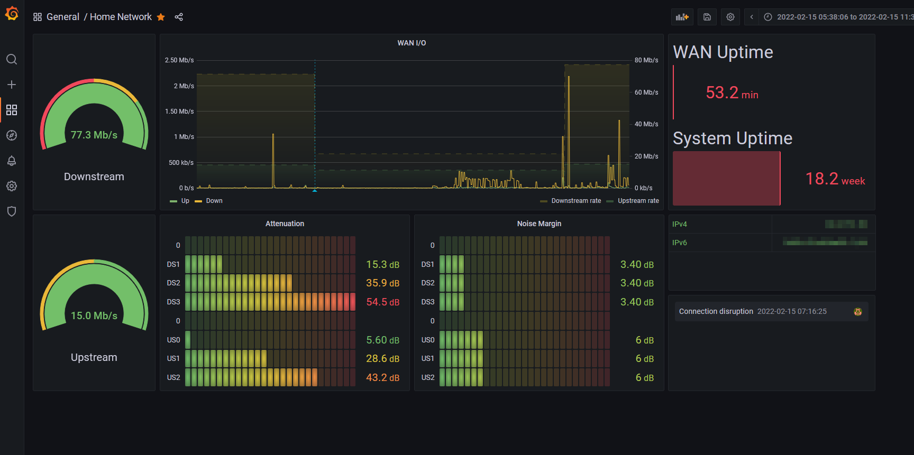

# Skyhub Prometheus Exporter

Export data scraped from your Sky Hub Model SR102 router.

## Configuration

```bash
port=8080 # The port that the internal webserver should use (optional, defaults to 8080)
skyhub_ip=192.168.0.1 # The IP address of your Sky Hub. If not specified, will default to 192.168.0.1
skyhub_password=<YOUR_PASS> #  The password for Sky Hub admin login.
```

## Accessing exported metrics

Once deployed using your preferred method below, metrics are accessed on the host machine via the `/metrics` subpath. E.g: http://localhost:8080/metrics

Example output:

```ini
# HELP skyhub_network_stats_tx_packets Number of transferred network packets
# Type skyhub_network_stats_tx_packets gauge
skyhub_network_stats_tx_packets{interface="wan"} 7.039086e+6
skyhub_network_stats_tx_packets{interface="lan"} 3.376977401e+9
skyhub_network_stats_tx_packets{interface="wlan"} 0e+0
# HELP skyhub_network_stats_rx_packets Number of recieved network packets
# Type skyhub_network_stats_rx_packets gauge
skyhub_network_stats_rx_packets{interface="wan"} 1.5925981e+7
skyhub_network_stats_rx_packets{interface="lan"} 1.665801163e+9
skyhub_network_stats_rx_packets{interface="wlan"} 0e+0
# HELP skyhub_network_stats_collision_packets Number of network packet collisions
# Type skyhub_network_stats_collision_packets gauge
skyhub_network_stats_collision_packets{interface="wan"} 0e+0
skyhub_network_stats_collision_packets{interface="lan"} 7.026e+4
skyhub_network_stats_collision_packets{interface="wlan"} 0e+0
# HELP skyhub_network_stats_tx_speed Network transfer speed in bytes per second
# Type skyhub_network_stats_tx_speed gauge
skyhub_network_stats_tx_speed{interface="wan"} 1.71511e+5
skyhub_network_stats_tx_speed{interface="lan"} 3.889389e+6
skyhub_network_stats_tx_speed{interface="wlan"} 0e+0
# HELP skyhub_network_stats_rx_speed Network recieve speed in bytes per second
# Type skyhub_network_stats_rx_speed gauge
skyhub_network_stats_rx_speed{interface="wan"} 3.812204e+6
skyhub_network_stats_rx_speed{interface="lan"} 1.77999e+5
skyhub_network_stats_rx_speed{interface="wlan"} 0e+0
# HELP skyhub_network_uptime Network interface uptime
# Type skyhub_network_uptime gauge
skyhub_network_uptime{interface="wan"} 4.139e+4
skyhub_network_uptime{interface="lan"} 1.1066107e+7
skyhub_network_uptime{interface="wlan"} 0e+0
# HELP skyhub_attenuation_up_db Upstream attenuation in decibels
# Type skyhub_attenuation_up_db gauge
skyhub_attenuation_up_db{interface="US0"} 5.6e+0
skyhub_attenuation_up_db{interface="US1"} 2.86e+1
skyhub_attenuation_up_db{interface="US2"} 4.32e+1
# HELP skyhub_attenuation_down_db Downstream attenuation in decibels
# Type skyhub_attenuation_down_db gauge
skyhub_attenuation_down_db{interface="DS1"} 1.53e+1
skyhub_attenuation_down_db{interface="DS2"} 3.59e+1
skyhub_attenuation_down_db{interface="DS3"} 5.45e+1
# HELP skyhub_noise_margin_up_db Upstream noise margin in decibels
# Type skyhub_noise_margin_up_db gauge
skyhub_noise_margin_up_db{interface="US0"} 6.1e+0
skyhub_noise_margin_up_db{interface="US1"} 6.1e+0
skyhub_noise_margin_up_db{interface="US2"} 6e+0
# HELP skyhub_noise_margin_down_db Downstream noise margin in decibels
# Type skyhub_noise_margin_down_db gauge
skyhub_noise_margin_down_db{interface="DS1"} 3.4e+0
skyhub_noise_margin_down_db{interface="DS2"} 3.4e+0
skyhub_noise_margin_down_db{interface="DS3"} 3.4e+0
# HELP skyhub_system_uptime Total system uptime in seconds
# Type skyhub_system_uptime gauge
skyhub_system_uptime 1.1066107e+7
# HELP skyhub_system_downstream_linerate Downstream Line Rate (Kbps)
# Type skyhub_system_downstream_linerate gauge
skyhub_system_downstream_linerate 7.7264e+4
# HELP skyhub_system_upstream_linerate Upstream Line Rate (Kbps)
# Type skyhub_system_upstream_linerate gauge
skyhub_system_upstream_linerate 1.5044e+4
# HELP skyhub_connection_info Sky Broadband Connection Information
# Type skyhub_connection_info gauge
skyhub_connection_info{dsl_interface_type="ptm",dsl_connected="1",ipv4_address="xxx.xxx.xxx.xxx",ipv4_subnet_mask="255.255.252.0",ipv6_address="0c0c:c0c:cc0:cc00::1/64",ipv6_gateway_address="0c0c:c0c:cc0:cc00:0000",ipv6_link_local_address="0c0c:c0c:cc0:cc00:0000",ipv6_delegated_prefix="0c0c:c0c:cc0:cc00::/56",dns_server_1="xxx.xxx.xxx.xxx",dns_server_2="xxx.xxx.xxx.xxx"} 1
```

## Build and run with NodeJS

```bash
# Install dependencies
$ npm install

# Run the development server
$ npm run start

# Run the deployment server
$ npm run deploy
```

## Building the Docker image

```bash
$ docker build . -t skyhub-prometheus-export
```

## Running the Docker image

Environment variable configuration is provided via `-e` flags in docker create command.

```docker
docker create \
 --name=skyhubExporter \
 -e port=8080 `# The port that the internal webserver should use (optional, defaults to 8080)` \
 -e skyhub_ip=192.168.0.1 `# The IP address of your Sky Hub. If not specified, will default to 192.168.0.1` \
 -e skyhub_password=<YOUR_PASS> `# The password for Sky Hub admin login.` \
 -p 8080:8080/tcp `# Http` \
 --restart unless-stopped \
 skyhubExporter-prometheus-export
```

## Docker compose

Environment variable configuration provided yaml environment list.

```yaml
---
version: '2'
services:
  skyhubExporter:
    image: skyhub-prometheus-export
    container_name: skyhubExporter
    restart: unless-stopped
    environment:
      - port=8080 # The port that the internal webserver should use (optional, defaults to 8080)
      - skyhub_ip=192.168.0.1 # The IP address of your Sky Hub. If not specified, will default to 192.168.0.1
      - skyhub_password=YOUR_PASS # The password for Sky Hub admin login.
    ports:
      - 8080:8080/tcp # WebUI
```

# Grafana Dashboard

See [this JSON model](grafana/dashboard.json) for a dashboard sample that utilizes the data from Prometheus.


